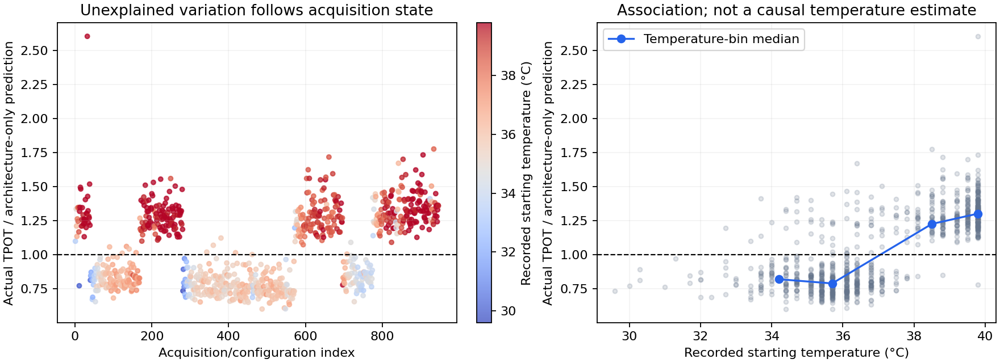

# Investigating device-state signal

Starting temperature retains predictive value across random splits, held-out acquisition blocks, and the new batch. The acquisition-index diagnostic improves random-split latency prediction dramatically but loses most of that advantage when whole blocks are withheld. This supports a substantial acquisition-state component in the labels, without identifying its physical cause.



New-batch snapshot: 73 valid rows, 1 excluded for nonpositive/missing/nonfinite targets/state. Snapshot SHA256 and exact IDs are recorded. No batch-2 measurements are used to fit, early-stop or select models.

| Protocol | Features | TPOT MAPE | TTFT MAPE | Energy MAPE |
|---|---|---:|---:|---:|
| random | architecture | 22.93% | 19.65% | 29.59% |
| random | architecture_temp | 9.05% | 8.34% | 21.96% |
| random | architecture_voltage_diagnostic | 22.01% | 18.80% | 29.07% |
| random | architecture_order_diagnostic | 6.34% | 5.86% | 21.26% |
| random | architecture_temp_voltage_diagnostic | 8.28% | 7.53% | 21.20% |
| held_out_order_block | architecture | 24.84% | 21.06% | 34.46% |
| held_out_order_block | architecture_temp | 9.90% | 9.08% | 24.50% |
| held_out_order_block | architecture_voltage_diagnostic | 27.15% | 22.83% | 36.50% |
| held_out_order_block | architecture_order_diagnostic | 22.01% | 17.76% | 34.34% |
| held_out_order_block | architecture_temp_voltage_diagnostic | 10.03% | 9.08% | 24.56% |
| forward_order | architecture | 25.56% | 23.47% | 34.40% |
| forward_order | architecture_temp | 11.59% | 10.59% | 26.14% |
| forward_order | architecture_voltage_diagnostic | 25.86% | 23.58% | 35.97% |
| forward_order | architecture_order_diagnostic | 13.56% | 14.53% | 32.75% |
| forward_order | architecture_temp_voltage_diagnostic | 10.66% | 10.09% | 26.02% |
| new_batch_saved_models | architecture | 23.15% | 18.76% | 27.86% |
| new_batch_saved_models | architecture_temp | 8.81% | 8.43% | 18.83% |

## What this can and cannot establish

- Random tests use five splits with distinct stopping sets. Block tests hold out five contiguous acquisition-ID ranges; forward test trains on the earliest 598, stops on the next 150, and evaluates the final 188. These are not verified session boundaries.
- All new fits use fixed original XGBoost settings and seed 42. New-batch evaluation uses original saved models for three seeds and no training on new-batch labels.
- Starting temperature is recorded before model transfer, shell setup and pre-idle, not at the exact inference start. thermal_zone17 is hard-coded; its sensor type is not validated in the script. Ending voltage/frequency are not available to an architecture searcher.
- Order and ending-voltage inputs are diagnostic only. They must not be mistaken for deployable architecture-only predictors.
- Better predictions conditional on temperature show association, not a causal thermal law. Temperature may capture session, placement, background-load or frequency behavior.
- New-batch snapshot is small and may occupy a narrow state range. Continued use for model selection would turn it into a validation set.
- No active model or watch scripts are changed. Models with temperature are not replacements for the architecture-only search baseline.

## Reproduce

```bash
conda activate nanollmforge
python scripts/sweep/investigate_state_signal.py --output scripts/sweep/outputs/state_signal_investigation_repeat
```
