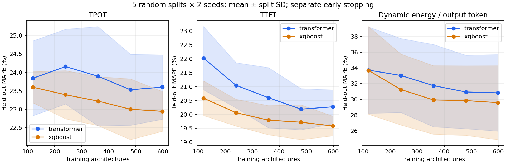

# Transformer data-scaling experiment

Architecture-only 936-row dataset. Each split has a pool of 598 training rows, 150 separate early-stopping rows, and 188 test rows. Nested training subsets: 120, 240, 360, 480, 598. Five random splits and two training/subset seeds, paired with XGBoost (50 Transformer fits and 150 XGBoost regressors).
Transformer: original two-layer, four-head, width-32 network, dropout 0.2, AdamW learning rate 0.0003. Up to 500 epochs with patience 40. Train-only feature and log-target scaling at each size. XGBoost: original depth-2 baseline. No per-size tuning or test-driven selection.

| Model | Training rows | TPOT MAPE | TTFT MAPE | Energy MAPE |
|---|---:|---:|---:|---:|
| transformer | 120 | 23.84% | 22.03% | 33.73% |
| transformer | 240 | 24.16% | 21.05% | 33.04% |
| transformer | 360 | 23.90% | 20.60% | 31.76% |
| transformer | 480 | 23.53% | 20.19% | 30.95% |
| transformer | 598 | 23.60% | 20.28% | 30.84% |
| xgboost | 120 | 23.60% | 20.59% | 33.69% |
| xgboost | 240 | 23.40% | 20.07% | 31.26% |
| xgboost | 360 | 23.22% | 19.80% | 29.94% |
| xgboost | 480 | 23.00% | 19.72% | 29.85% |
| xgboost | 598 | 22.95% | 19.59% | 29.59% |



## Limits

- Previously chosen hyperparameters and an already-explored dataset are reused. These curves are exploratory and not an independent performance claim.
- The five test splits overlap. Shaded split SD is descriptive, not a confidence interval or five independent prospective trials.
- The fixed 150-row stopping set provides supervision even at the smallest training size. Training-size labels exclude these rows.
- Training subsets are nested within each split/seed; changing the seed changes both the subset ordering and model initialization.
- No temperature, voltage, measured performance, config ID or run order appears among inputs. No batch-2 measurements were merged.
- Learning curves stop at 598 fitting rows and cannot establish behavior at several thousand rows. Energy labels remain prefill-inclusive.
- Transformer fits reaching the 500-epoch cap: 0/50. Inspect training.csv for best and stopping epochs.

## Reproduce

```bash
conda activate nanollmforge
python scripts/sweep/transformer_learning_curve.py --output scripts/sweep/outputs/transformer_learning_curve_repeat
```
