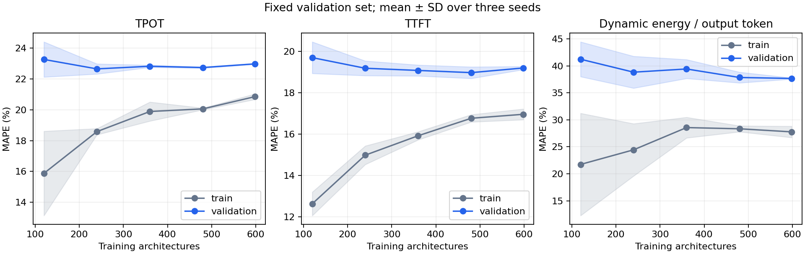

# Why are surrogate errors high?

936 observations, fixed 598 training / 150 validation / 188 test split. Three training seeds. Learning curves use the fixed validation set and stratified training subsets. Validation still controls early stopping, so it is not a new independent test.

| Variant | Target | MAPE (%) | MAE | R² |
|---|---|---:|---:|---:|
| baseline | tpot_ms | 23.39 | 12.984 | 0.780 |
| baseline | ttft_ms | 19.71 | 200.482 | 0.741 |
| baseline | dynamic_energy_per_token_mj | 28.07 | 6.271 | 0.761 |
| optimized | tpot_ms | 23.34 | 12.781 | 0.755 |
| optimized | ttft_ms | 20.19 | 206.946 | 0.709 |
| optimized | dynamic_energy_per_token_mj | 29.29 | 6.500 | 0.755 |
| start_temperature_only | tpot_ms | 10.06 | 5.590 | 0.936 |
| start_temperature_only | ttft_ms | 8.54 | 86.684 | 0.912 |
| start_temperature_only | dynamic_energy_per_token_mj | 19.43 | 3.903 | 0.865 |



## Methods

- Baseline reproduces the original XGBoost feature set and settings.
- Optimized: target-specific search over 25 settings (original/physics features, depth, child weight, squared/absolute log loss). Three-fold CV runs entirely inside the 598 training rows. Every fold has a separate early-stopping subset. Hyperparameters are frozen before test evaluation.
- Temperature-conditioned: original baseline settings plus only starting CPU temperature. No ending voltage or measured performance is an input. Checkpoints and feature metadata are saved separately.
- An additional state diagnostic includes ending voltage; it is explanatory only and is not a deployable architecture-only surrogate.

## Interpretation limits

Starting temperature can encode operating conditions or measurement-session differences. Improved prediction does not prove temperature causes the performance change. It changes the prediction task from architecture-only to architecture conditional on known starting state. Random split results do not establish generalization across charging cycles, sessions, devices or temperatures outside the data.
The old test set has already been inspected repeatedly, so these are exploratory results. Prospective measurements and repeated architectures under matched conditions are needed before a strong accuracy claim. Neither a flat learning curve nor temperature improvement measures irreducible measurement noise.

## Reproduce

```bash
conda activate nanollmforge
python scripts/sweep/diagnose_surrogate_error.py --output scripts/sweep/outputs/xgboost_error_diagnosis_repeat
python scripts/sweep/report_error_diagnosis.py scripts/sweep/outputs/xgboost_error_diagnosis_repeat
```
